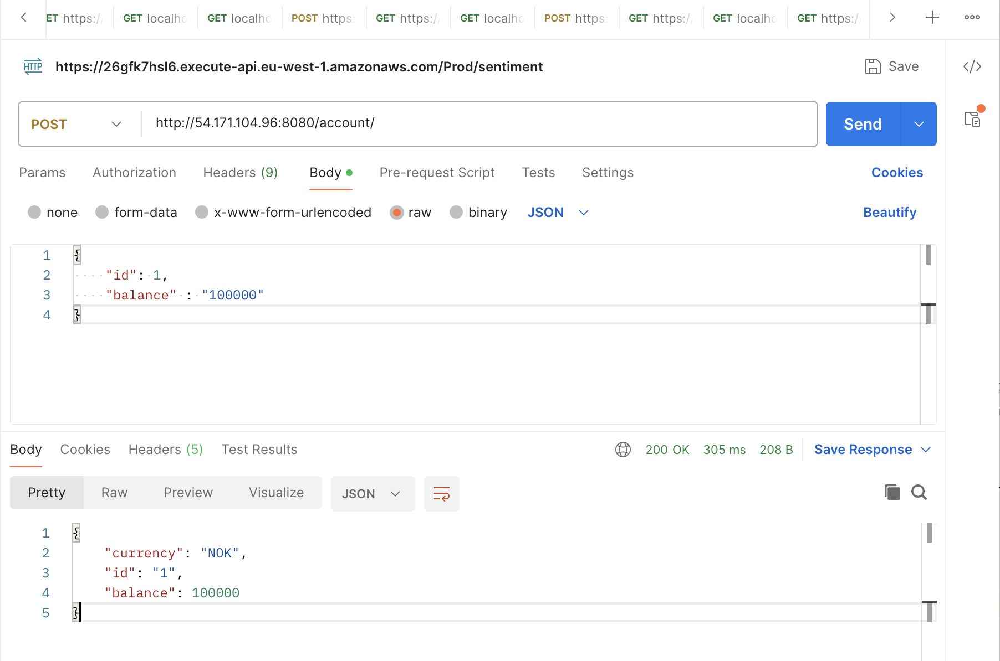
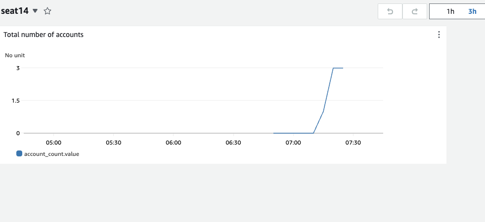

# Business Metrics with Spring Boot og CloudWatch & Terraform

The application in this repository is a "mock" bank application that features various endpoints for common banking transactions.
In this exercise, you will learn how to instrument a Spring Boot application with business metrics. By business metrics, we refer to metrics that do not pertain to the technical performance of the application, but rather to insights into user behavior, such as the amount of money transferred and the number of transactions performed.
This exercise utilizes Java, Spring Boot, and a metrics framework called Micrometer.
We will also explore how to visualize metrics in AWS CloudWatch and how to use Terraform to create a dashboard.

# Prepare your Cloud 9 environment

Log in to your Cloud 9 environment as usual

*Important. When you use both Java- and Terraform in the same lab, you might run out of disk space on your Cloud 9 instance.* It is recomended to go through the instructions 
in this document in the beginning of the lab to increase the disk size. 
https://github.com/glennbechdevops/cloud9_tools

It takes 10-20 minutes to actually increase the size available to the instance so it's better to do this up front. 

## Terraform pro tip 

Instead of using the Terraform installation that comes with Cloud9, we can use "tfenv" - a tool that 
allows us to download and use different versions of Terraform. This is very useful to know since you might work in an 
environment with several different projects or teams that use different Terraform versions.

```sh   
git clone https://github.com/tfutils/tfenv.git ~/.tfenv
echo 'export PATH="$HOME/.tfenv/bin:$PATH"' >> ~/.bash_profile
sudo ln -s ~/.tfenv/bin/* /usr/local/bin
```

To see what versions are available 

```sh
tfenv list-remote
```

Let's pick 1.7.4 which is pretty recent - use will also install if the version is not downloaded on your computer.

```sh
tfenv use 1.7.4
```

Set up terraform to use this version 

```sh
tfenv use 1.7.4
terraform --version
```

Check that it worked!

## Install JQ

Jq is a great tool to work with JSON from the command line 

```
sudo yum install jq
```

## Use Terraform to Create a CloudWatch Dashboard

* Clone this repo into your Cloud9 environment (Remember to clone with the HTTP URL)
* Look in the "infra" directory - here you will find the file dashboard.tf which contains Terraform code for a CloudWatch Dashboard.
* As you can see, the dashboard is described in a JSON format. Here you can find documentation https://docs.aws.amazon.com/AmazonCloudWatch/latest/APIReference/CloudWatch-Dashboard-Body-Structure.html
Here you also see how one often includes text or code using "Heredoc" syntax in Terraform code, so that we don't have to worry about "newline", "Escaping" of special characters, etc. (https://developer.hashicorp.com/terraform/language/expressions/strings)

```hcl
resource "aws_cloudwatch_dashboard" "main" {
  dashboard_name = var.student_name
  dashboard_body = <<DEATHSTAR
{
  "widgets": [
    {
      "type": "metric",
      "x": 0,
      "y": 0,
      "width": 12,
      "height": 6,
      "properties": {
        "metrics": [
          [
            "${var.student_name}",
            "account_count.value"
          ]
        ],
        "period": 300,
        "stat": "Maximum",
        "region": "eu-west-1",
        "title": "Total number of accounts"
      }
    }
  ]
}
DEATHSTAR
}
```
## Task 

* Run terraform init / plan / apply from your Cloud 9 environment.
* you have to type in a student name, why?
* Can you think of at least two ways to fix it so that you don't have to type a student name on plan/apply/destroy?
* Navigate to the AWS Cloudwatch service, See that a Dashboard is created in CloudWatch

## Look at the Spring Boot application

Oepn *BankAccountController.Java* , You'll find this code

```java
    @Override
    public void onApplicationEvent(ApplicationReadyEvent applicationReadyEvent) {
        Gauge.builder("account_count", theBank,
                b -> b.values().size()).register(meterRegistry);
    }
```

This creates a new metric - of the type Gauge, which constantly reports how many bank accounts exist in the system by 
counting the size of the values in the map holding the accounts. 

## Modify the MetricsConfig Class

You need to modify the MetricsConfig class and use your own name for the cloudwatch namespace, replace the empty string "" with your student name.  

````java
 return new CloudWatchConfig() {
        private Map<String, String> configuration = Map.of(
                "cloudwatch.namespace", "",
                "cloudwatch.step", Duration.ofSeconds(5).toString());
        
        ....
    };
````

Install Maven in Cloud 9. We will try to run the Spring Boot application from Maven in the terminal.

```
sudo wget http://repos.fedorapeople.org/repos/dchen/apache-maven/epel-apache-maven.repo -O /etc/yum.repos.d/epel-apache-maven.repo
sudo sed -i s/\$releasever/6/g /etc/yum.repos.d/epel-apache-maven.repo
sudo yum install -y apache-maven

```

## Start the Spring Boot application


From the folder where you cloned repository for this exercise; Start the Spring boot app with maven with
```
mvn spring-boot:run
```

The code in this repository exposes a REST interface at http://localhost:8080/account

## Test the API (Advanced option)

Curl is a command-line tool used to transfer data to or from a server, supporting a wide range of protocols 
including HTTP, HTTPS, FTP, and more. It is widely used for testing, sending  requests, and interacting with APIs directly 
from the terminal or in scripts.

If you don't feel like using curl, but would prefer postman or something and run the tests from your local computer; follow these instructions 

Find the Security group (A kind of firewall) protecting your Cloud 9 machine. 

```shell
 aws ec2 describe-instances --instance-ids $(curl -s http://169.254.169.254/latest/meta-data/instance-id) --query 'Reservations[*].Instances[*].SecurityGroups[*].GroupId' --output text
```
Open traffic from everywhere on port  8080 ```YOUR SECURITY GROUP ID``` is the output form the previous command

```shell
aws ec2 authorize-security-group-ingress --group-id <YOUR SECURITY GROUP ID>  --protocol tcp --port 8080 --cidr 0.0.0.0/0
```

Find the IP address of your computer

```shell
 curl -s http://169.254.169.254/latest/meta-data/public-ipv4
```

You can then use for example postman to access your API - or even curl again from your mac or windows machine 
(example with teacher IP address)

```
 curl --location --request POST 'http://54.246.38.229:8080/account' \
--header 'Content-Type: application/json' \
--data-raw '{
    "id": 3,
    "balance" : "100000"
}'|jq
```




### Use Curl instead (Chicken option)

If you feel like just using the Cloud 9 terminal to test the API curl is your friend

Create an account with an id and balance
```sh
curl --location --request POST 'http://localhost:8080/account' \
--header 'Content-Type: application/json' \
--data-raw '{
    "id": 3,
    "balance" : "100000"
}'|jq
```

* See information about an account

```sh 
  curl --location --request GET 'http://localhost:8080/account/1' \
  --header 'Content-Type: application/json'|jq
```

* Transfer money from one account to another  (It will create accounts if they do not exist)

```sh
curl --location --request POST 'http://localhost:8080/account/2/transfer/3' \
--header 'Content-Type: application/json' \
--data-raw '{
    "fromCountry": "SE",
    "toCountry" : "US",
    "amount" : 500
}
'|jq
```

## Check that we see data in the dashboard

* Go to the AWS UI, and select the CloudWatch service. Choose "Dashboards".
* Search for your own student name and open the dashboard you created.
* See that you get data points on the graph.

It should look something like this:



# PART 2

## Gauge for the Bank's Total Sum
You are now going to create a Micrometer Gauge that displays the net balance of the bank. Place it in the correct location in the code.

```shell
// This meter type "Gauge" reports the total amount of money in the bank
Gauge.builder("bank_sum", theBank,
                b -> b.values()
                        .stream()
                        .map(Account::getBalance)
                        .mapToDouble(BigDecimal::doubleValue)
                        .sum())
        .register(meterRegistry);
```


## Create a New Widget in the CloudWatch Dashboard
Extend the Terraform code so that it displays an additional widget for the metric bank_sum.
Hint: you will need to change the X/Y values so they do not overlap!

## Cloudwatch Alarm
We will create an Alarm that is triggered if the total sum of the bank exceeds a given amount.

This can be done using CloudWatch. We will also create a module for this alarm, so others can benefit from it.

We will also use the service SNS, Simple Notification Service. By sending a message to an SNS topic when the alarm is triggered, we can respond to such a message, for example, by sending an email, running a lambda function, etc.

## Create Terraform Module
We will now create a Terraform module. While we work on it, it's smart to keep it on a local filesystem so we do not need to do git add/commit/push etc., to update the code.

1. Create a new folder under infra/ called _alarm_module_  
2. In this folder, create a new Terraform file named main.tf

Take not of the fact that we're following best practices, and adding a prefix that we'll use in naming resources. This way, more than one 
instance of this module can be used in same AWS Envrionment

```shell
resource "aws_cloudwatch_metric_alarm" "threshold" {
  alarm_name  = "${var.prefix}-threshold"
  namespace   = var.prefix
  metric_name = "bank_sum.value"

  comparison_operator = "GreaterThanThreshold"
  threshold           = var.threshold
  evaluation_periods  = "2"
  period              = "60"
  statistic           = "Maximum"

  alarm_description = "This alarm goes off as soon as the total amount of money in the bank exceeds an amount."
  alarm_actions     = [aws_sns_topic.user_updates.arn]
}

resource "aws_sns_topic" "user_updates" {
  name = "${var.prefix}-alarm-topic"
}

resource "aws_sns_topic_subscription" "user_updates_sqs_target" {
  topic_arn = aws_sns_topic.user_updates.arn
  protocol  = "email"
  endpoint  = var.alarm_email
}

```

### A Little Explanation About the aws_cloudwatch_metric_alarm Resource

- **Namespace** is typically your student name. It's the same value that you changed in the MetricsConfig.java file.
- There are a wide range of `comparison_operator` options to choose from!
- `evaluation_periods` and `period` work together to avoid the alarm being triggered by short-term "spikes" or outlier observations.
- `statistic` is an operation that is performed on all values within a time interval given by `period` - for a `Gauge` metric, in this case, we choose Maximum.
- Notice how one `resource` refers to another in Terraform!
- Terraform creates both an SNS Topic and an email subscription.

## Create a new file in the same directory, `variables.tf`

```shell

variable "threshold" {
  default = "50"
  type = string
}

variable "alarm_email" {
  type = string
}

variable "prefix" {
  type = string
}

```

## Create a new file in the same directory, outputs.tf

```
output "alarm_arn" {
  value = aws_sns_topic.user_updates.arn
}
```

You can now modify main.tf in the /infra directory to include your module. It will then look like this:

```shell
resource "aws_cloudwatch_dashboard" "main" {
  dashboard_name = var.student_name
  dashboard_body = <<DASHBOARD
{
  "widgets": [
    {
      "type": "metric",
      "x": 0,
      "y": 0,
      "width": 12,
      "height": 6,
      "properties": {
        "metrics": [
          [
            "${var.student_name}",
            "account_count.value"
          ]
        ],
        "period": 300,
        "stat": "Maximum",
        "region": "eu-west-1",
        "title": "Total number of accounts"
      }
    }
  ]
}
DASHBOARD
}

module "alarm" {
  source = "./alarm_module"
  alarm_email = var.alarm_email
  prefix = var.student_name
}

```

## Finally, you must change variables.tf in the /infra folder, and add the variable. 
```hcl
variable "alarm_email" {
    type = string
}
```
Because we do not want to hardcode email, or any specific values in our Terraform code. Feel free to set your own email address as the default value for this variable 

# Run the Terraform Code from Cloud9

## Go to the infra directory. Run:

```shell
terraform init
terraform apply

```

Note that Terraform asks you for values for variables that do not have default values. This will not work when we want GitHub Actions to run Terraform for us. Do you remember how you can give these arguments on the command line? You can also create default values for the variables if you wish - as long as you understand how this works.

## Confirm Email

For SNS to be allowed to send you emails, you must confirm your email address. You will receive an email with a link you must click the first time you run terraform apply.

## Manually Test the Alarm and Email Sending Using SNS
* Go to the AWS console
* Go to SNS
* From the left menu, select "Topics"
* Find your own Topic
* Test sending an email by pressing "Publish message" at the top right of the page

## Trigger the Alarm!

Try to create new accounts, or a new account, so that the bank's total sum exceeds 1 MNOK.

```shell
curl --location --request POST 'http://localhost:8080/account' \
--header 'Content-Type: application/json' \
--data-raw '{
    "id": 999,
    "balance" : "5000000"
}'|jq

```

- Check that the alarm goes off by seeing that you have received an email.
- Go to CloudWatch Alarms in AWS and see that the alarm's state is `IN_ALARM`.
- Get the bank's balance back to 0, for example by creating an account with a negative balance.
- See that the alarm's state moves away from `IN_ALARM`.

DONE!
